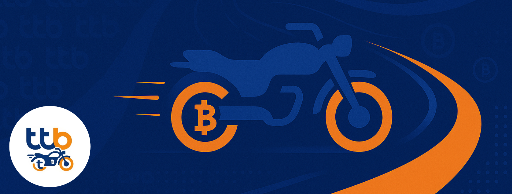

<p align="center">
  
</p>

# TTB Ride - Agentic AI Chatbot Motorcycle loans Demo service 
### “เมื่อคุณขอ คุณพร้อมจ่าย เราพร้อมให้” operated by AI Chatbot

> **Experimental project – not an official TTB product or service.**  
> This repository is a **demo/prototype** for exploring agentic AI and document-driven flows with Gradio + LangGraph.  
> It is **not** affiliated with, endorsed by, or operated by TTB Bank. It does **not** issue real credit decisions and should **not** be used in production.

https://github.com/user-attachments/assets/d958d84b-9657-481d-8299-10fb442cb8af

## What is this?

An experimental chatbot that guides a user through a **motorcycle-loan**-style flow:

- Detects user **intent** to apply, then asks for 3 uploads: **bike photo**, **income slip**, **Thai ID**.
- Uses an OCR client (pluggable) and a VLM for **document checks** and **bike value estimation**.
- Applies a simple rule (demo-only):  
  **approved = min( 50% × monthly income, appraised bike value )**.
- Shows a short **“Happy/Unhappy”** path for feedback and re-apply.

Built with **Gradio** (UI), **LangGraph** (routing), **LangChain + OpenAI** (LLMs/VLM), **Pillow** (image handling).

---

## Project structure

```
ttb-ride-demo/
├─ app/
│  └─ main.py                 # Gradio UI & event wiring
├─ assets/
│  ├─ cover.png               # hero image shown at the top of the UI
│  └─ congrats.png            # shown when user clicks "Happy"
├─ ttb_ride/
│  ├─ llm/
│  │  ├─ __init__.py
│  │  └─ engine.py            # Chat/VLM wrappers, structured outputs, context handling
│  ├─ ocr/
│  │  ├─ __init__.py
│  │  ├─ client.py            # Functions that call your OCR client
│  │  ├─ ocr_agent.py         # Your OCR client class (OlmOCRClient) – adapt as needed
│  │  └─ olmocr_service_ttb_ride.py  # Modal service for the OCR model (optional)
│  ├─ utils/
│  │  ├─ __init__.py
│  │  ├─ debug.py             # ring-buffer logger & markdown rendering
│  │  ├─ images.py            # base64/data-URL helpers; safe resizing
│  │  └─ text.py              # sanitizers, Thai ID checksum, name matching
│  ├─ agents.py               # LangGraph node logic (router, docops, appraise)
│  ├─ config.py               # model & asset paths, theme defaults
│  ├─ schemas.py              # pydantic models for structured outputs
│  ├─ state.py                # Typed state + new_state()
│  ├─ ui_theme.py             # CSS helpers for layout/branding
│  └─ visualize.py            # turns the LangGraph into a PNG for the UI
├─ .env                       # your environment variables (not committed)
└─ requirements.txt
```

---

## Quick start

```bash
# 1) clone
git clone https://github.com/<your-org-or-user>/ttb-ride-demo.git
cd ttb-ride-demo

# 2) create a virtual environment (Python 3.10–3.11 recommended)
python -m venv .venv
# Windows
.venv\Scripts\activate
# macOS/Linux
source .venv/bin/activate

# 3) install deps
pip install -r requirements.txt

# 4) set env vars
# Create a .env in the repo root (see sample below)

# 5) run the app (from repo root)
python -m app.main
# open http://localhost:7862
```

**`run.bat` / `run.ps1`** (optional): create these tiny launchers at repo root if you like. They simply call `python -m app.main`.

---

## Environment variables (`.env`)

Create a file named `.env` in the project root:

```
# OpenAI
OPENAI_API_KEY=sk-xxxxxxxxxxxxxxxxxxxxxxxx

# Models (override if needed)
MODEL_TEXT=gpt-4o-mini
MODEL_VLM=gpt-4o-mini

# UI theme background (R,G,B)
BG_RGB=16,44,92

# Assets folder and specific images
ASSETS_DIR=assets
COVER_IMAGE_PATH=assets/cover.png
CONGRATS_IMAGE_PATH=assets/congrats.png
```

> The OCR integration calls **`ttb_ride/ocr/ocr_agent.py` → `OlmOCRClient`**. Provide your own implementation or adapt the included one to your OCR service. If the OCR service is not available, the demo flows that depend on parsed fields will not complete.

---

## Deploying the OCR model on Modal (optional)

This repo includes **`ttb_ride/ocr/olmocr_service_ttb_ride.py`**, a small service for deploying the OCR model with [Modal](https://modal.com/). Use it if you want to run the same OCR model we used for the demo.

**Prereqs**
- `pip install modal`
- Create a Modal account and authenticate: `modal setup`

**Steps**

1. Open `ttb_ride/ocr/olmocr_service_ttb_ride.py` and review the config at the top (e.g., model ID, image processor options, resources).  
2. **Deploy** the service from the repo root:
   ```bash
   # Development (hot reload within Modal):
   modal serve ttb_ride/ocr/olmocr_service_ttb_ride.py

   # Production-style deployment:
   modal deploy ttb_ride/ocr/olmocr_service_ttb_ride.py
   ```
   Modal will print a base URL for your app.
3. Restart the demo: `python -m app.main`.

> The service exposes the endpoints that `OlmOCRClient` uses (e.g., for Thai ID and income slip OCR). Check the code to confirm the exact route names your client calls and add any required API key or headers as needed.

---

## How it works

```
flowchart TD
  start([start]) --> router
  router -- intent & not approved --> docops
  router -- otherwise --> chat
  router -- nothing to do --> end([end])

  docops -- docs complete --> appraise
  docops -- else --> end

  appraise --> end
  chat --> end
```

- **router**: classifies “motorcycle-loan intent” and decides whether to show uploads or just chat back.
- **docops**: checks each upload (bike → is-motorcycle; ID → OCR + checksum; income → OCR & parse).  
  When all good, it flags an appraisal.
- **appraise**: VLM rough appraisal + simple rule → “approved amount”. Shows **Happy/Unhappy** buttons.
- **Happy/Unhappy buttons**: generate a short LLM response and set flags for re-apply; they **don’t** run the graph again.
- **Visualize**: In the right panel, open **Orchestration Graph → Refresh graph** to render the graph (requires `langgraph[all]` or Graphviz).

---

## Troubleshooting

- **`ModuleNotFoundError: No module named 'ttb_ride'`**  
  Run from the repo root with `python -m app.main`, or use the provided run scripts.

- **Graph image doesn’t render**  
  Install extras: `pip install "langgraph[all]"` or install Graphviz on your system.

- **Images not shown**  
  Ensure files exist under `assets/` and `.env` points to them (or remove overrides to use defaults).

- **OCR errors**  
  Make sure `ttb_ride/ocr/ocr_agent.py` matches your OCR server

---

## Security & disclaimer

- This repository is for **education/research**.  
- It is **not** an official TTB system and **does not** provide real lending decisions or any banking service.  
- **Do not** upload real personal information. Use synthetic/test data only.  
- Review and comply with the terms of any third-party APIs you enable.

---

## Credits

- Built with ❤️ using Gradio, LangGraph, LangChain, Pillow, and Modal.  
- “ttb-ride-demo” name used here **only** to describe the demo project; no affiliation with TTB Bank.
